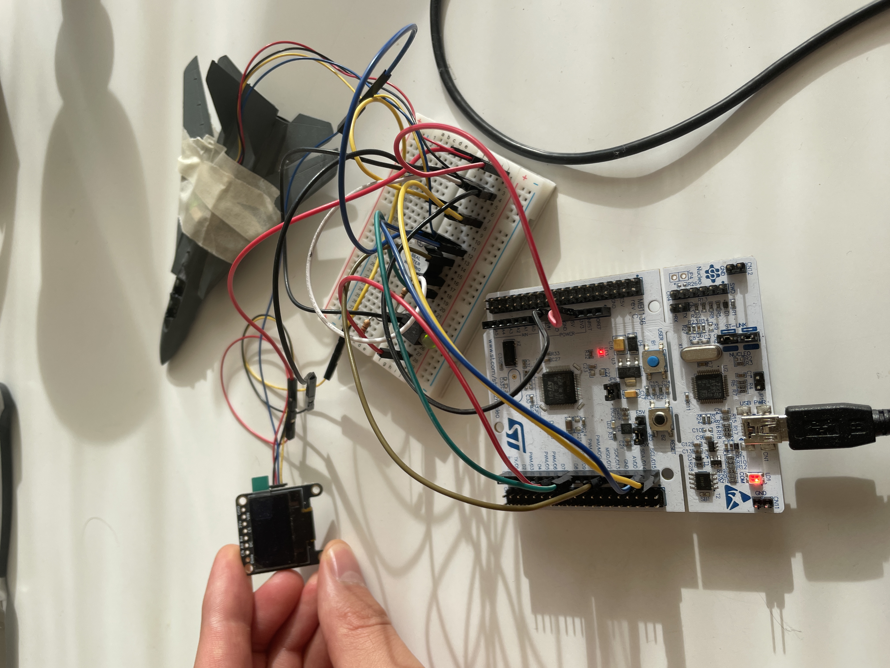
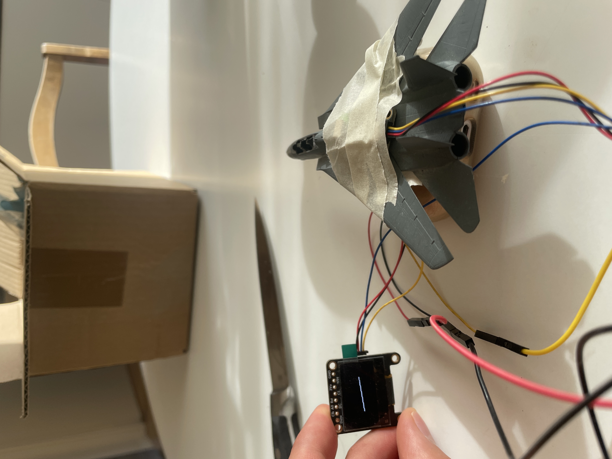
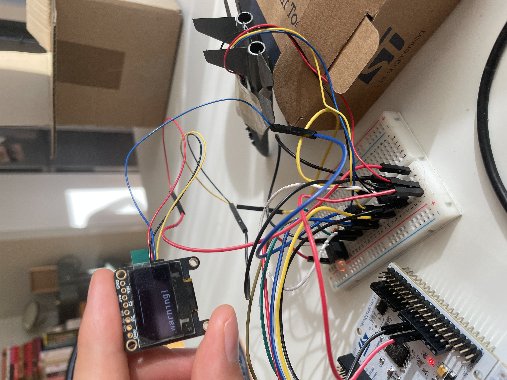
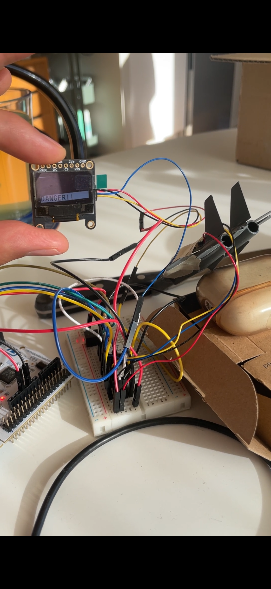

# Aircraft Attitude Monitor (STM32)

An STM32-based device that measures and interprets aircraft attitude in real time. It reads an IMU over I2C, fuses gyroscope and accelerometer data into a stable angle estimate using a hand-written Kalman filter, draws the attitude as an artificial horizon on an OLED display, and warns of a dangerous attitude with an LED and a buzzer, before the limit is actually crossed.

### Normal attitude (SAFE)

### Warning

### Danger

## Hardware

- Nucleo-F411RE (STM32F411, ARM Cortex-M4)
- LSM6DSOX IMU (accelerometer + gyroscope), I2C
- SSD1306 OLED display, 128x64, I2C
- Bi-color LED and a magnetic buzzer (WT-1209T, driven by PWM at 2.4 kHz)

## Features

- Sensor fusion without a library: Kalman filter for pitch, complementary filter for roll
- Automatic tracking and removal of gyroscope bias (drift)
- Adaptive tuning: the filter adjusts how much it trusts each sensor based on motion
- Artificial horizon on the OLED display
- SAFE / WARNING / DANGER state machine with hysteresis to prevent flicker at the thresholds
- Predictive warning: alerts before the limit is crossed
- Runs standalone, no computer required

## Implementation notes

The project was built one stage at a time, each stage ending in something that worked: blinking LED → printf over UART → IMU responding over I2C → angles computed → display → alerts → state machine → prediction. Every working stage was committed separately.

The sensor fusion was written from scratch on purpose. A complementary filter came first, so that gyroscope drift and accelerometer noise could be observed directly, and only then the Kalman filter. The hard part was not writing the algorithm but making it behave on noisy real-world data.
